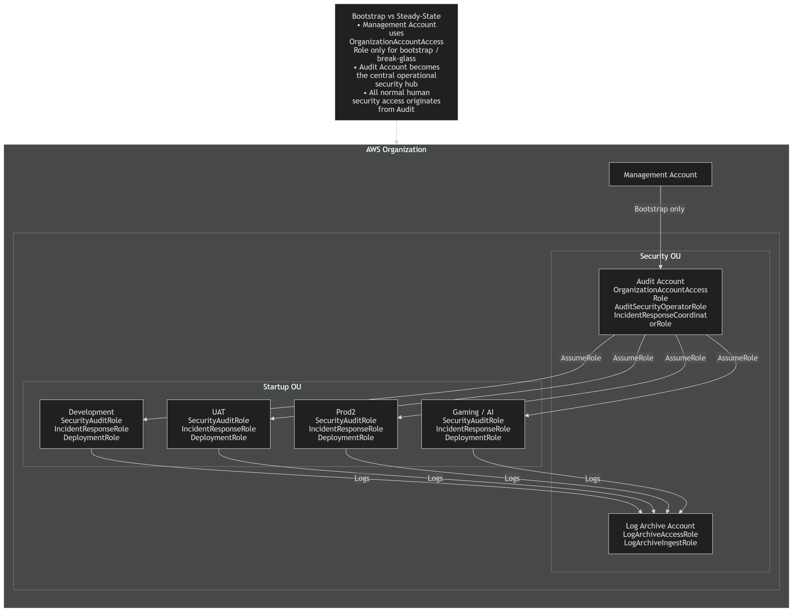

# IAM Cross-Account Access (AWS)

This project demonstrates production-grade IAM cross-account access using AWS STS AssumeRole in a multi-account AWS Organization.

---

## Architecture Overview

This design uses the **Audit account as a central security hub**.  
All human and security access flows from Audit into workload accounts using scoped IAM roles.

High-level flow:
- Management → Audit (human access, MFA enforced)
- Audit → Workload accounts (role-based, short-lived access)



---

## IAM Role Matrix

This project uses the **Audit account as the central security hub**.  
All human and security access flows **from Audit → into workload accounts** via tightly scoped IAM roles.

The design is aligned to AWS Organizations best practices and scales cleanly across multiple OUs and environments.

---

## Organizational Structure

- **Security OU**
  - Audit
  - Log Archive
- **Startup OU**
  - Development
  - UAT
  - Prod2
  - Gaming / AI

---
## The Role Assumption Flow

```
┌─────────────────────────────────────────────────────────────────────────────┐
│                   AWS ORGANIZATIONS ROLE ASSUMPTION FLOW                   │
└─────────────────────────────────────────────────────────────────────────────┘

     MANAGEMENT ACCOUNT                            AUDIT ACCOUNT
     ══════════════════                            ═════════════

  ┌──────────────────────┐                    ┌──────────────────────────┐
  │ 1. Admin/User in     │                    │                          │
  │    Management acct   │                    │                          │
  │    has permission to │                    │                          │
  │    assume bootstrap  │                    │                          │
  │    role              │                    │                          │
  └──────────┬───────────┘                    │                          │
             │                                │                          │
             ▼                                │                          │
  ┌──────────────────────┐                    │ 2. Assume               │
  │ OrganizationAccount  │───────────────────▶│    OrganizationAccount  │
  │ AccessRole used for  │                    │    AccessRole in Audit  │
  │ initial bootstrap    │                    │                          │
  └──────────┬───────────┘                    │  ┌────────────────────┐  │
             │                                │  │ Trusts management  │  │
             │                                │  │ account by default │  │
             │                                │  └────────────────────┘  │
             ▼                                │                          │
  ┌──────────────────────┐                    │                          │
  │ 3. Create dedicated  │                    │                          │
  │    AuditSecurity     │                    │                          │
  │    OperatorRole      │                    │                          │
  │    in Audit account  │                    │                          │
  └──────────┬───────────┘                    └──────────────────────────┘
             │
             ▼
  ┌──────────────────────┐
  │ 4. Ongoing access    │
  │    uses dedicated    │
  │    AuditSecurity     │
  │    OperatorRole      │
  │    not bootstrap role│
  └──────────────────────┘

```
Audit to member accounts

```
┌─────────────────────────────────────────────────────────────────────────────┐
│                 OPERATIONAL CROSS-ACCOUNT ACCESS FLOW                      │
└─────────────────────────────────────────────────────────────────────────────┘

        AUDIT ACCOUNT                              MEMBER ACCOUNT
        ═════════════                              ══════════════

  ┌──────────────────────┐                    ┌──────────────────────────┐
  │ 1. Security operator │                    │                          │
  │    signs into Audit  │                    │                          │
  │    account and uses  │                    │                          │
  │    AuditSecurity     │                    │                          │
  │    OperatorRole      │                    │                          │
  └──────────┬───────────┘                    │                          │
             │                                │                          │
             ▼                                │                          │
  ┌──────────────────────┐                    │ 2. STS AssumeRole       │
  │  Calls STS           │───────────────────▶│    into workload role   │
  │  AssumeRole for      │                    │    e.g. SecurityAudit   │
  │  target account role │                    │    Role / DevAccessRole │
  │                      │                    │                          │
  └──────────┬───────────┘                    │  ┌────────────────────┐  │
             │                                │  │ Trust policy checks│  │
             │                                │  │ ✓ Audit acct       │  │
             │                                │  │ ✓ Named role       │  │
             │                                │  │ ✓ Conditions       │  │
             │                                │  └────────────────────┘  │
             │◀───────────────────────────────│                          │
             │                                │ 3. Temporary creds      │
             ▼                                │    returned             │
  ┌──────────────────────┐                    └──────────────────────────┘
  │ 4. Perform approved  │
  │    actions in target │
  │    account based on  │
  │    least privilege   │
  └──────────────────────┘
```

---

## Security OU – Roles

### Audit Account (Central Security Hub)

| Role Name | Purpose | Permissions | Trust |
|---------|--------|------------|-------|
| **AuditSecurityOperatorRole** | Primary human-operated security role | IAM, CloudTrail, GuardDuty, Security Hub, cross-account AssumeRole | Management account (MFA enforced) |
| **IncidentResponseCoordinatorRole** | Coordinate incidents across accounts | `sts:AssumeRole` into workload IR roles | Audit account only |
| **SecurityAuditRole** *(optional)* | Self-audit of Audit account | `SecurityAudit`, `ViewOnlyAccess` | Audit account only |

**Notes**
- No IAM users exist in workload accounts
- Audit is the **only source of human access**
- `OrganizationAccountAccessRole` is used only for bootstrap / break-glass

---

### Log Archive Account

| Role Name | Purpose | Permissions | Trust |
|---------|--------|------------|-------|
| **LogArchiveAccessRole** | Read/query centralised logs | S3 read, Athena, Glue | Audit account only |
| **LogArchiveIngestRole** | Allow workloads to write logs | S3 write-only | Workload accounts |

**Notes**
- Humans never log directly into Log Archive
- Clear separation between log **writers** and **readers**

---

## Startup OU – Standard Workload Roles  
*(Applied consistently to Development, UAT, Prod2, Gaming/AI)*

### Core Roles (present in every workload account)

| Role Name | Purpose | Permissions | Trust |
|---------|--------|------------|-------|
| **SecurityAuditRole** | Read-only security review | `SecurityAudit`, `ViewOnlyAccess` | AuditSecurityOperatorRole |
| **IncidentResponseRole** | Active incident handling | EC2, VPC, IAM read + tightly scoped write | AuditSecurityOperatorRole |
| **DeploymentRole** | CI/CD deployments | Scoped service permissions (ECS, Lambda, S3, etc.) | CI/CD pipeline role |

---

## Environment-Specific Permission Tightening

The **same role names** are used across environments, but permissions are progressively restricted.

### Development
- IncidentResponseRole:
  - Can stop/start instances
  - Can modify security groups
- DeploymentRole:
  - Broader service access for iteration

### UAT
- IncidentResponseRole:
  - Limited rollback-only actions
- DeploymentRole:
  - Pipeline-driven only

### Prod2
- IncidentResponseRole:
  - Break-glass style
  - No IAM writes
  - No destructive actions
- DeploymentRole:
  - CI/CD only
  - No console usage

This approach preserves **consistency**, **automation**, and **defence in depth**.

---

---
## Implementation Steps
### Step 1: Set Up the Trust Relationship
```
┌─────────────────────────────────────────────────────────────────┐
│                     TRUST POLICY ANATOMY                        │
├─────────────────────────────────────────────────────────────────┤
│                                                                 │
│  {                                                              │
│    "Version": "2012-10-17",                                     │
│    "Statement": [                                               │
│      {                                                          │
│        "Effect": "Allow",          ◄── Explicit allow           │
│        "Principal": {                                           │
│          "AWS": "arn:aws:iam::111111111111:root"               │
│        },                          ◄── WHO can assume           │
│        "Action": "sts:AssumeRole", ◄── The action               │
│        "Condition": {                                           │
│          "StringEquals": {                                      │
│            "sts:ExternalId": "UniqueSecretValue"               │
│          },                        ◄── Confused deputy fix      │
│          "Bool": {                                              │
│            "aws:MultiFactorAuthPresent": "true"                │
│          }                         ◄── MFA required             │
│        }                                                        │
│      }                                                          │
│    ]                                                            │
│  }                                                              │
│                                                                 │
└─────────────────────────────────────────────────────────────────┘
```
### Step 2: Create the Permission Policy
Apply least privilege by scoping to exactly what's needed:
```
┌─────────────────────────────────────────────────────────────────┐
│                    LEAST PRIVILEGE APPROACH                     │
├─────────────────────────────────────────────────────────────────┤
│                                                                 │
│  BAD (Overprivileged):              GOOD (Least Privilege):     │
│  ─────────────────────              ────────────────────────    │
│                                                                 │
│  {                                  {                           │
│    "Effect": "Allow",                 "Effect": "Allow",        │
│    "Action": "ec2:*",     ✗           "Action": [               │
│    "Resource": "*"                      "ec2:DescribeInstances",│
│  }                                      "ec2:DescribeVpcs",     │
│                                         "ec2:DescribeSubnets"   │
│                                       ],                   ✓    │
│                                       "Resource": "*"           │
│                                     }                           │
│                                                                 │
└─────────────────────────────────────────────────────────────────┘
```
### Step 3: Configure the Assuming Role
```
┌─────────────────────────────────────────────────────────────────┐
│              PERMISSION TO ASSUME (Security Account)            │
├─────────────────────────────────────────────────────────────────┤
│                                                                 │
│  {                                                              │
│    "Version": "2012-10-17",                                     │
│    "Statement": [                                               │
│      {                                                          │
│        "Effect": "Allow",                                       │
│        "Action": "sts:AssumeRole",                              │
│        "Resource": [                                            │
│          "arn:aws:iam::222222222222:role/SecurityAuditRole",   │
│          "arn:aws:iam::333333333333:role/LogArchiveRole"       │
│        ]                                                        │
│      }                           ▲                              │
│    ]                             │                              │
│  }                               │                              │
│                                  │                              │
│         Explicitly list allowed roles ─┘                        │
│         Never use wildcards here!                               │
│                                                                 │
└─────────────────────────────────────────────────────────────────┘
```
---

## Trust Model (Single Principle)

> **All human access originates from the Audit account.  
> Workload accounts expose narrowly scoped roles that trust only approved Audit or CI/CD identities.**

---

## Why This Model

- Eliminates IAM user sprawl
- Reduces blast radius
- Enables organisation-wide automation (Terraform / StackSets)
- Mirrors real enterprise AWS security operating models
- Makes access patterns easy to reason about and audit

This role matrix is the foundation for:
- Project 2: SCP Guardrails
- Project 3: Centralised Logging & Detection


---

The project focuses on secure access patterns, operational realism, and scalability rather than simplified lab configurations.


## Design Decisions, Pitfalls Encountered, and Lessons Learned

This project intentionally reflects real-world AWS IAM complexity. During implementation, several non-obvious behaviours and trade-offs were encountered and addressed. These are documented below to demonstrate operational understanding rather than “happy-path” configuration.

---

### 1. Bootstrap vs Steady-State Access

**What happened**  
Initial access to member accounts (Audit and Development) was performed using the automatically created `OrganizationAccountAccessRole`.

**Why this matters**  
This role provides full administrative access and is designed for bootstrap and break-glass scenarios, not day-to-day security operations.

**Decision taken**  
- Used `OrganizationAccountAccessRole` only to bootstrap access
- Created a dedicated `AuditSecurityOperatorRole` in the Audit account
- All ongoing security operations are performed via the dedicated Audit role

**Outcome**  
Clear separation between bootstrap access and operational access, aligned with enterprise AWS Organizations practices.

---

### 2. Trusting Account Root vs Trusting a Specific Role

**What happened**  
The initial trust policy for the Development `SecurityAuditRole` trusted the entire Audit account (`arn:aws:iam::<AUDIT_ACCOUNT_ID>:root`).

**Why this was suboptimal**  
- Any principal in the Audit account with `sts:AssumeRole` permission could potentially assume the role
- This conflicted with the design goal of restricting access to a single security operator role

**Decision taken**  

- The trust policy was tightened to trust only: `arn:aws:iam::<AUDIT_ACCOUNT_ID>:role/AuditSecurityOperatorRole`

**Outcome**  
- Reduced blast radius
- Clear role-to-role trust
- Stronger, interview-ready security posture

---

### 3. ExternalId Usage and Selection

**What happened**  
An ExternalId was required to mitigate the confused deputy problem, but choosing an appropriate value was non-obvious.

**Decision taken**  
- Generated a UUID-style ExternalId
- Used the same ExternalId in:
  - The Development role trust policy
  - The STS AssumeRole call
- Treated it as a shared secret between trusted roles

**Outcome**  
- Confused deputy risk mitigated
- Clear documentation of why and how ExternalId is used

---

### 4. MFA Enforcement and Role Chaining Behaviour

**What happened**  
When `aws:MultiFactorAuthPresent = true` was enforced on the Development role trust policy, chained role assumption failed.

**Root cause**  
AWS does **not reliably propagate MFA context across chained role assumptions** (e.g. Management → Audit → Development).  
The second role sees the caller as a role session, not a human-authenticated MFA session.

**Decision taken**  
- MFA enforcement retained on the **human access boundary** (Management → Audit)
- MFA condition removed from the **role-to-role trust** (Audit → Development)
- Relied on:
  - Explicit role trust
  - ExternalId
  - Short-lived credentials

**Outcome**  
- Reliable chained role assumption
- MFA still enforced where it provides real value
- Design reflects real-world AWS IAM behaviour

---

### 5. Manual Bootstrap vs Infrastructure as Code

**What happened**  
Some IAM roles had to be created manually before automation could be applied.

**Decision taken**  
- Manual creation used only for:
  - Bootstrap access
  - Initial role establishment
- All steady-state IAM configuration is represented in Terraform
- Manual steps explicitly documented rather than hidden

**Outcome**  
- Practical and realistic workflow
- Avoided circular dependency issues
- Strong narrative for audits and interviews

---

### 6. Why AssumeRole Instead of Long-Lived Credentials

**Decision rationale**
- Short-lived credentials reduce exposure
- Automatic rotation
- Full CloudTrail auditability
- No secret sprawl
- Easier revocation and blast-radius control

This project deliberately avoids creating additional IAM users in member accounts.

---

---
## How Would This Scale ?

```
                        ┌─────────────────┐
                        │  SECURITY HUB   │
                        │    ACCOUNT      │
                        └────────┬────────┘
                                 │
           ┌─────────────────────┼─────────────────────┐
           │                     │                     │
           ▼                     ▼                     ▼
    ┌──────────────┐     ┌──────────────┐     ┌──────────────┐
    │ Startup OU   │     │  Further OU  │     │  Sandbox OU  │
    ├──────────────┤     ├──────────────┤     ├──────────────┤
    │ ┌──────────┐ │     │ ┌──────────┐ │     │ ┌──────────┐ │
    │ │Account 1 │ │     │ │Account 10│ │     │ │Account 50│ │
    │ └──────────┘ │     │ └──────────┘ │     │ └──────────┘ │
    │ ┌──────────┐ │     │ ┌──────────┐ │     │ ┌──────────┐ │
    │ │Account 2 │ │     │ │Account 11│ │     │ │Account 51│ │
    │ └──────────┘ │     │ └──────────┘ │     │ └──────────┘ │
    │     ...      │     │     ...      │     │     ...      │
    └──────────────┘     └──────────────┘     └──────────────┘

    At scale: Use AWS Organizations with SCPs + StackSets
    to deploy consistent roles across all accounts
```
---

## Summary

The final design reflects a **production-grade IAM model**, not a simplified tutorial:
- Bootstrap access is isolated and minimized
- Operational access is role-based and auditable
- MFA is enforced where technically effective
- Trust relationships are tightly scoped
- AWS STS limitations are understood and accounted for

These decisions mirror patterns used in mature multi-account environments built on AWS Organizations.


